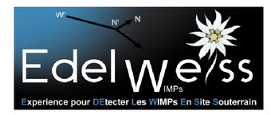

#PhD work : direct searches for Dark Matter

## Presentation and dissertation  

- [PhD dissertation (English)](https://github.com/tdeboissiere/PhD_work/blob/master/PhD_thesis_deBoissiere.pdf)
- [PhD defense slides (French)](https://github.com/tdeboissiere/PhD_work/blob/master/PhD_presentation_deBoissiere.pdf)

## Publication list

- [Measurement of the cosmogenic activation of germanium detectors in EDELWEISS-III](https://arxiv.org/abs/1607.04560)
- [Improved EDELWEISS-III sensitivity for low-mass WIMPs using a profile likelihood approach](https://arxiv.org/abs/1607.03367)
- [Constraints on low-mass WIMPs from the EDELWEISS-III dark matter search](https://arxiv.org/abs/1603.05120)
- [Scintillating bolometers based on ZnMoO$_4$ and Zn$^{100}$MoO$_4$ crystals to search for 0$ν$2$β$ decay of $^{100}$Mo (LUMINEU project): first tests at the Modane Underground Laboratory](http://arxiv.org/abs/1502.01161)
- [Low mass WIMP search with EDELWEISS-III: First Results](http://arxiv.org/abs/1504.00820)
- [Axion searches with the EDELWEISS-II experiment](http://iopscience.iop.org/article/10.1088/1475-7516/2013/11/067/meta;jsessionid=7A09D1C5167417CEFD88848F6F56774F.c2.iopscience.cld.iop.org)
- [Searches for axions with the EDELWEISS experiment](http://arxiv.org/abs/1309.3062)

## Dark matter direct detection with EDELWEISS: brief summary

In spite of the recent successes of observational cosmology, most of the universe remains poorly known. Known particles (which we call baryons) only make up 5% of the total content of the universe. The standard cosmological model contains two other components: Dark Energy and Dark Matter (respectively 70% and 25% of the total content). Dark Matter, which is generally believed to be a non-relativistic, charge neutral and non-baryonic new form of matter, is the central focus of this work. I studied two likely candidates, namely WIMPs and axions. My analyses were carried out within the EDELWEISS collaboration which operates detectors sensitive to both WIMP and axion signals.

Axions were first introduced to solve the strong CP problem. They can be produced in the Sun through a variety of processes and in some models, they may also contribute to the Dark Matter density. In this work, we used EDELWEISS data to search for axions through four distinct production-detection mechanisms. These mechanisms involve the coupling of axions to nucleons, photons and electrons. No excess over background was found. These null observations allowed us to set stringent constraints on the axion couplings and exclude several orders of magnitude of the axion mass within specific QCD axion models.

On the other hand, WIMPs are the canonical dark matter candidate whose mass lies in the GeV-TeV range. With the motivation of recent theoretical developments and possible signal hints, we focused our effort on so-called low mass WIMPs (3 to 25 GeV). This thesis describes a new multivariate analysis specifically designed for this mass range, which we tuned using an unblinded fraction of the data set (35 kg.d) from a single EDELWEISS detector. No significant signal over background excess was found and we set an upper limit on the spin-independent WIMP-nucleon cross section of 1.48E-6 pb at 10 GeV.

## Codes

- **Codes/Run308_Axion_searches** : codes to look for axion signals in the EDELWEISS experiment data
- **Codes/Run308_WIMP_searches** : codes to look for Weakly Interacting Massive Particles in the EDELWEISS experiment data
